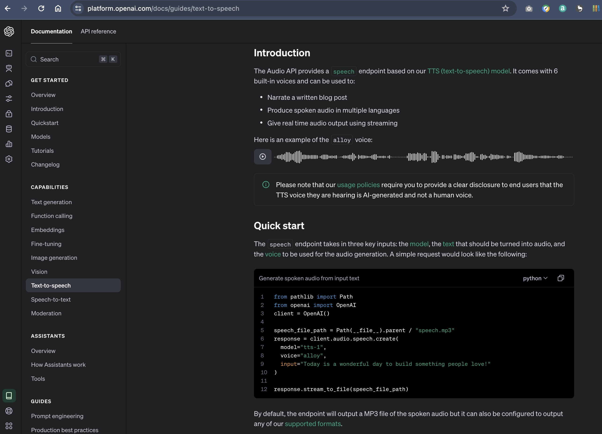

## Image to Speech

### make sure you have Python >= 3.10.0 version installed.
1. Create your virtual env
```sh
python -m venv venv
source venv/bin/activate
```

2. install python libs
```sh
pip install -r requirements.txt
```

3. run streamlit to lanch web app
```sh
streamlit run app.py
```


